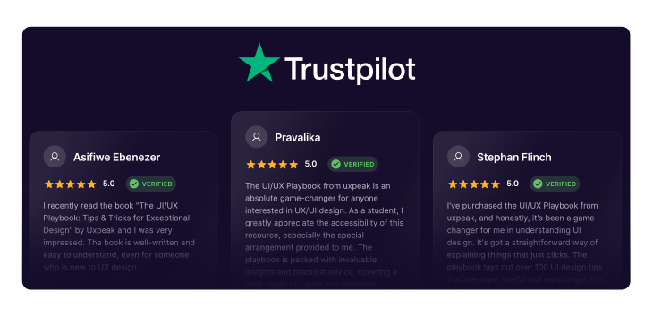
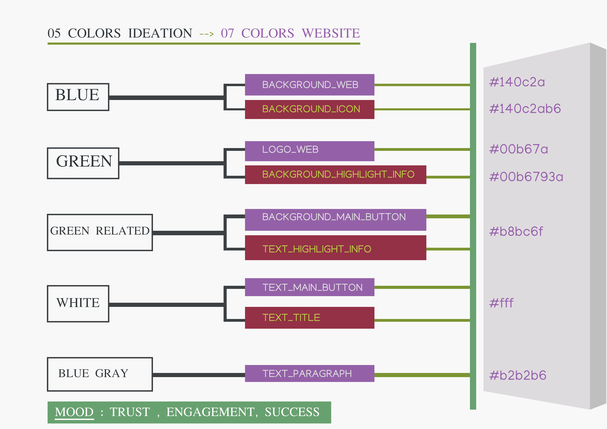

## Analyzing trustpilot cover

    trustpilot-color-typography.png

### Colors Pattern

#### 1. background-color

    Hex code: #140c2a

 

    Type: strong **Blue**

#### 2. headline-color

    Hex code: #00b67a

 

    Type: medium **Green**

#### 3. variant-headline-color

    Hex code: #68bc6f

 

    Type: medium-light **Green**

#### 4. tint-headline-color

    Hex code: #00b6793a

 

    Type: (deep-blur)-medium **Green**

#### 5. text-title

    Hex code: #fff

 

    Type: pure **White**

#### 6. text-paragraph

    Hex code: #b2b2b6

 

    Type: light **Blue-Gray**

#### 7. tint-background-color

    Hex code: #443e55

 

    Type: (blur)-strong **Blue**

 

## Interpretation

### A. **07** colors appearance.

**One** : strong **Blue** <u>Background</u> ~ `Trust , Reliability, Confidence`

**Two** : strong **Green** <u>Logo Website</u> ~ `Maturity , Experience`

**Three** : mid-strong **Green** <u>Button/Text-highlight</u> ~ `Engagement , Growth`

**Four** : tint-strong **Green** <u>Background data-highlighted</u> ~ `refreshing , appealing, peaceful`

**Five** : strong **White** <u>Text-title</u> ~ `Readibility , Neutral, Highlight`

**Six** : light **Blue-Gray** <u>Text-paragraph</u> ~ `Readibility, Harmony, Appealing`

**Seven** : tint-strong **Blue** <u>Background-icon</u> ~ `Softness , Hierarchy, Harmony`

 

### B. **05** colors Ideation.

| Color | Type     | cover          | Hex Code Sample |
| ----- | -------- | -------------- | --------------- |
|       | Original | background-web | #140c2a         |
| Blue  |

### 1. Blue

| Color | Type     | cover           | Hex Code Sample |
| ----- | -------- | --------------- | --------------- |
|       | Original | background-web  | #140c2a         |
| Blue  |          |                 |                 |
|       | tint     | background-icon | #140c2ab6       |

### 2. Green

| Color | Type     | cover                       | Hex Code Sample |
| ----- | -------- | --------------------------- | --------------- |
|       | Original | logo-web                    | #00b67a         |
| Green |          |                             |                 |
|       | tint     | highlighted-data-background | #00b6793a       |

### 3. Green Foster

| Color | Type     | cover                  | Hex Code Sample |
| ----- | -------- | ---------------------- | --------------- |
|       |          | background-main-button |                 |
| Green | Original |                        | #b8bc6f         |
|       |          | highlighted-data-text  |                 |

### 4. White

| Color | Type     | cover            | Hex Code Sample |
| ----- | -------- | ---------------- | --------------- |
|       |          | text-main-button |                 |
| White | Original |                  | #fff            |
|       |          | text-title       |                 |

### 5. Blue Gray

| Color | Type     | cover          | Hex Code Sample |
| ----- | -------- | -------------- | --------------- |
|       |          |                |                 |
| Gray  | Original | text-paragraph | #b2b2b6         |
|       |          |                |                 |

### C. Colors Graph.

### Mood Website :

> `Trust, Engagement, Success`

 

 

// image drawn with GIMP

 

    trustpilot-graph.png
